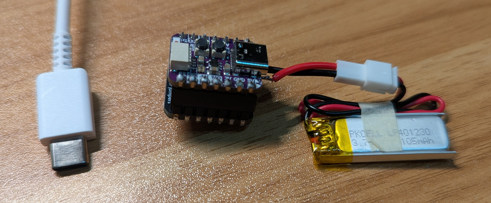

# Dazzo Monitor

Ultra-lightweight (10g) BLE movement tracker for indoor pet monitoring.



## Transmitter

### Hardware

- [Adafruit QT Py S3](https://www.adafruit.com/product/5700) - WiFi Dev Board
- [Adafruit BNO055 + BMP280 BFF](https://www.adafruit.com/product/5937) - Motion & Pressure Sensor
- [100mAh LiPo Battery](https://www.adafruit.com/product/1570)
- Headers & connectors: [Female](https://www.adafruit.com/product/2940), [Male](https://www.adafruit.com/product/3002), [JST Cable](https://www.adafruit.com/product/3814)

### Setup

1. Install [CircuitPython](https://circuitpython.org/board/adafruit_qtpy_esp32s3_4mbflash_2mbpsram/) on the QT Py
2. Copy [`transmitter/`](transmitter) code to the device
3. (Optional) Update libraries from [circuitpython.org/libraries](https://circuitpython.org/libraries)

## Receiver

Python service that receives BLE telemetry data via Nordic UART.

### Usage

**Requirements:** Python 3.12+

```bash
# Install dependencies
uv sync

# Run receiver
cd receiver
uv run main.py
```
